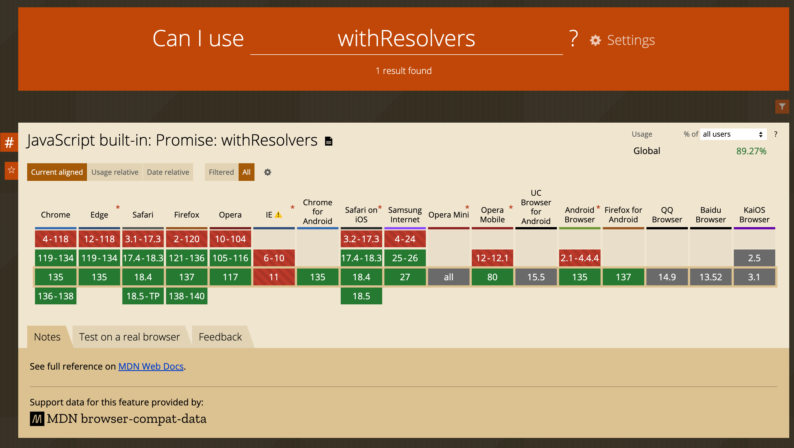

## Promise

Promise는 자바스크립트에서 비동기 처리를 쉽게 할 수 있게 돕는 객체로 ES2015에 등장했다.
then, catch 문이나 async, await문과 같이 사용할 수 있고 자바스크립트로 웹 서비스를 개발하는 사람들에게는 굉장히 친숙한 객체이다.

```tsx
const timer = new Promise((resolve) => {
  setTimeout(() => {
    resolve(true);
  }, 100);
});

timer.then(() => {
  console.log('Time out!');
});
```

Promise는 콜백의 인자로 resolve와 reject 함수를 넘겨준다.
하지만 이 함수들은 외부로 공개되지 않기 때문에 우리는 내부 콜백 안에서 resolve와 reject를 처리해줘야하는 번거로움이 있다.
외부에서 이 함수들을 호출하려면 외부 변수에 해당 함수들을 할당해줘야 한다.

```tsx
let timerResolve = null;

const timer = new Promise((resolve) => {
  timerResolve = resolve;
});

setTimeout(() => {
  timerResolve();
}, 100);

timer.then(() => {
  console.log('Time out!');
});
```

## Promise.withResolvers란?

Promise.withResolvers는 이러한 번거로움을 해결하기 위한 새로운 문법으로 ES2024에 표준으로 등록됐다.
`new Promise((resolve, reject) => { ... })`를 쉽게 대체할 수 있도록 만들어진 함수로 Promise 객체와 resolve/reject 함수를 한꺼번에 깔끔하게 얻을 수 있게 해준다.

```tsx
const { promise: timer, resolve: timerResolve } = Promise.withResolvers(); // { promise, resolve, reject }

setTimeout(() => {
  timerResolve();
}, 100);

timer.then(() => {
  console.log('Time out!');
});
```

## 기존 방식과의 차이는?

기존의 외부 변수에 resolve와 reject를 할당하는 방식은 변수 할당 시점이 달라지거나 잘못된 값이 할당될 위험이 있다.
반면 Promise.withResolvers는 반환되는 시점에 Promise, resolve, reject가 모두 고정되기 때문에 안전한 코드를 작성할 수 있다.
또한 resolve와 reject를 외부에서 더욱 쉽게 관리할 수 있게 되면서 비동기 처리를 더 쉽게 할 수 있게 됐다.

## Promise.withResolvers 활용하기

Promise.withResolvers는 비동기 처리 완료 시점이 Promise 내부에서 처리되지 않고 외부에서 처리되어야할 때 사용할 수 있다.

### 예시) React Ref Element 보장하기

React useEffect 안에서 ref에 할당된 element를 사용하려고 할 때 target element가 조건부 렌더링 되어 useEffect 실행 이후에 렌더링 되게 되면 로직이 원하는대로 실행되지 않는 경우가 있다.
이는 ref가 변경되어도 리렌더링 되지 않기 때문에 useEffect가 재실행되지 않기 때문이다. 이를 해결하기 위해 useRef 대신 useState를 사용하는 경우도 있으나 불필요한 리렌더링을 유발하게 된다.

```tsx
import { useRef, useEffect } from 'react';

interface Props {
  state: 'A' | null;
}

const Component = ({ state }: Props) => {
  const ref = useRef<HTMLDivElement | null>(null);

  useEffect(() => {
    if (ref.current === null) {
      return;
    }

    ref.current.scrollTo({ top: 0 }); // 최초 상태값이 null이라면 상태값이 A로 변경되어도 해당 로직이 실행되지 않음.
  }, []);

  if (state === null) {
    return null;
  }

  return <div ref={ref}>A</div>;
};
```

이럴 때 Promise.withResolvers를 이용하면 불필요한 리렌더링 없이 target element가 렌더링 된 이후에 원하는 로직이 실행되도록 보장할 수 있다.

```tsx
interface Props {
  state: 'A' | null;
}

const Component = ({ state }: Props) => {
  const [{ promise: waitForElement, resolve: elementRendered }] = useState(() => {
    return Promise.withResolvers();
  });

  useEffect(() => {
    waitForElement.then(() => {
      ref.current.scrollTo({ top: 0 }); // target element 렌더링 후 실행됨을 보장
    });
  }, [waitForElement]);

  if (state === null) {
    return null;
  }

  return <div ref={elementRendered}>A</div>;
};
```

## Promise.withResolvers 사용시 주의할 점

24년에 새롭게 추가된 표준인만큼 브라우저 지원 범위를 확인해보아야 한다.
글이 쓰여진 25년 4월 27일 기준으로 약 89% 정도의 브라우저에서는 별도의 polyfill 없이 사용이 가능하다.
지원 범위가 아닌 브라우저에서 사용하려면 polyfill을 사용해주거나 babel을 이용해 구 버전 문법으로 트랜스파일링 해줘야한다.



Promise.withResolvers는 resolve나 reject가 한번 호출되면 상태가 고정된다는 점을 유의해야한다.
resolve와 reject가 외부로 노출됐다고 해서 상태를 계속해서 변경할 수 있다고 착각하기 쉽다.
하지만 한번 호출되면 상태가 고정되니 이 점을 꼭 유의하고 사용해야 한다.

## 마무리

Promise.withResolvers를 사용하면 비동기 코드를 더 깔끔하고 명확하게 작성할 수 있다.
특히 복잡한 이벤트 흐름이나 외부 제어가 필요한 경우, 서비스 코드 품질을 높이는 데 큰 도움이 될 것이다.
