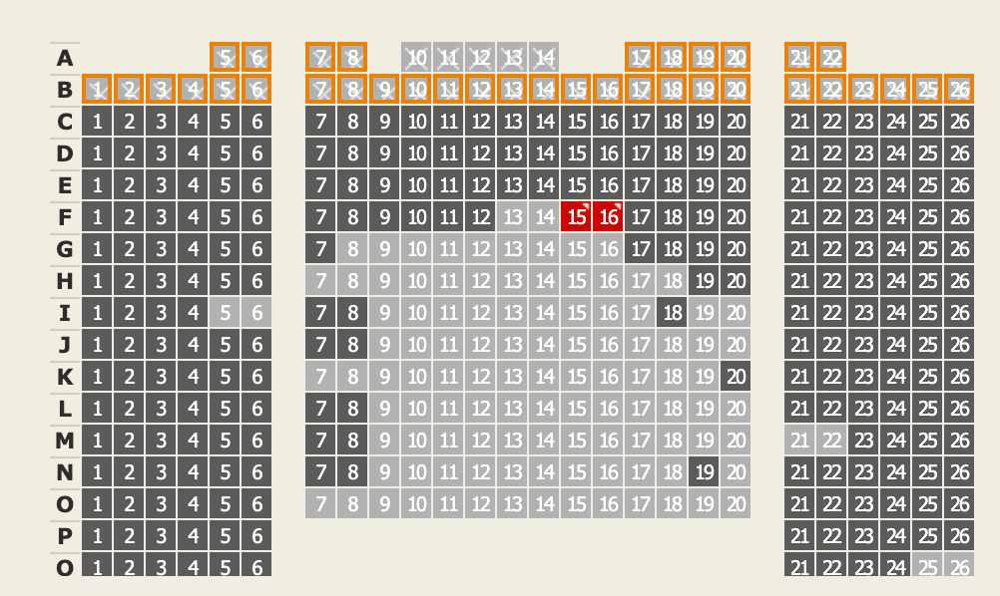

import testPng from './test.png';

# Header1

## Header2

### Header3

#### Header4

##### Header5

###### Header6

normal text

([URL Link](https://en.wikipedia.org/wiki/Salted_duck_egg))

```tsx
const test = 'code';
const func = () => {
  return null;
};
```

`백틱 문자열`

**굵은 글자**

_강조하는 글자_

~~취소선~~

<Kbd>Ctrl</Kbd>

- 리스트 1
  - 리스트 1-1
  - 리스트 2-2
- 리스트 2
- 리스트 3

- [ ] todo
- [x] done

1. number1
2. number1-1
3. number1-2
4. number2
5. number3

## split line




<Image src={testPng} alt="hi" />

---
